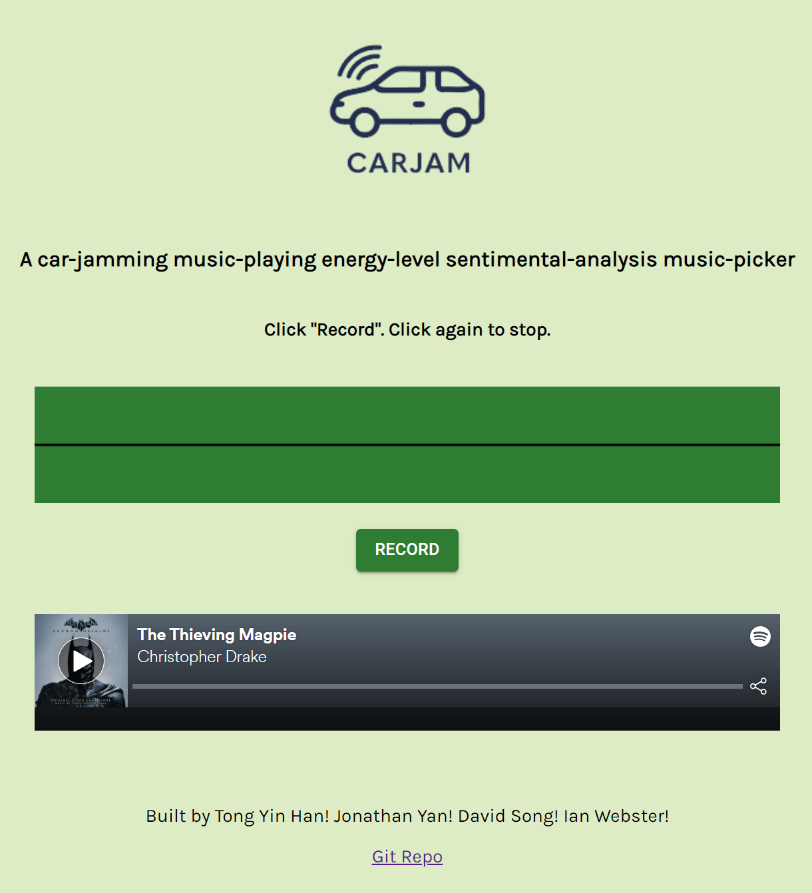

# carjam

## Frontend

## Setup

1. Install Node.js
2. cd to backend folder
`npm i`
3. cd to frontend folder
`npm i` 

3.1 Create a .env file with API keys and ports.

4. run backend (runs on port 3000)
`node server.js`
5. run frontend
`npm run start` (runs on port 3001)
6. launch browser at https://localhost:3001

## Audio Resources 
- https://stackoverflow.com/questions/48554502/sending-audio-blob-data-from-a-react-frontend-to-a-express-backend